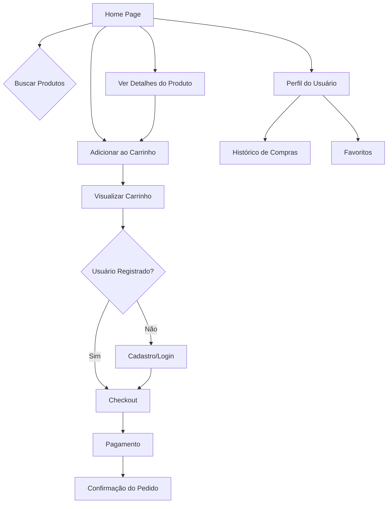

## 1. Product Overview

DetailX é um aplicativo moderno de e-commerce desenvolvido para oferecer uma experiência de compra online intuitiva e eficiente. O aplicativo combina um catálogo de produtos bem organizado com funcionalidades de carrinho de compras e busca inteligente.

O DetailX resolve o problema da dificuldade em encontrar produtos específicos e gerenciar compras online ao fornecer uma plataforma centralizada com busca por imagens e organização por categorias. É voltado para consumidores que buscam uma experiência de compra simplificada e visual.

O produto tem como objetivo se tornar uma solução líder no mercado de e-commerce, oferecendo uma experiência superior com recursos avançados de busca visual e gestão de compras.

## 2. Core Features

### 2.1 User Roles

| Role         | Registration Method  | Core Permissions                                                                   |
| ------------ | -------------------- | ---------------------------------------------------------------------------------- |
| Visitor      | No registration      | Visualizar produtos, adicionar ao carrinho, buscar produtos                        |
| Registered User | Email registration   | Finalizar compras, salvar favoritos, histórico de compras, múltiplos endereços     |

### 2.2 Feature Module

O DetailX consiste nas seguintes páginas principais:

1. **Home**: Catálogo de produtos, busca por nome, visualização em grid/lista
2. **Product Detail**: Visualização detalhada do produto, imagens ampliadas, especificações
3. **Cart**: Visualização do carrinho, edição de quantidades, cálculo de total
4. **Checkout**: Processo de finalização de compra, formulário de entrega e pagamento
5. **Search Results**: Resultados de busca com filtros por categoria, preço e relevância
6. **User Profile**: Histórico de compras, favoritos, configurações de conta

### 2.3 Page Details

| Page Name | Module Name                | Feature description                                                                                                             |
| --------- | -------------------------- | ------------------------------------------------------------------------------------------------------------------------------- |
| Home      | Catálogo de Produtos       | Grid responsivo de produtos com imagem, nome, preço e botão adicionar. Busca por nome com filtro em tempo real                  |
| Home      | Campo de Busca            | Barra de pesquisa no header com sugestões automáticas e busca por nome de produto                                               |
| Home      | Carrinho Fixo             | Ícone de carrinho no header/footer mostrando quantidade de itens e valor total                                                  |
| Product   | Detalhes do Produto        | Página com imagem ampliada, descrição detalhada, preço, especificações e botão de adicionar ao carrinho                       |
| Cart      | Lista de Itens            | Tabela com produtos, quantidades editáveis, preço unitário e total. Botão para remover itens                                  |
| Cart      | Resumo do Pedido          | Cálculo de subtotal, frete e total. Botão para prosseguir para checkout                                                         |
| Checkout  | Formulário de Entrega      | Campos para endereço, CEP, cidade, estado. Validação em tempo real                                                            |
| Checkout  | Formulário de Pagamento    | Cartão de crédito, boleto ou PIX. Campos seguros com máscara                                                                  |
| Search    | Resultados de Busca        | Lista filtrável de produtos com ordenação por preço e relevância. Filtros laterais por categoria                               |
| Profile   | Histórico de Compras       | Lista de pedidos anteriores com status, data e valor. Detalhes de cada pedido                                                  |
| Profile   | Favoritos                 | Grid de produtos salvos com opção de adicionar ao carrinho diretamente                                                         |
| Profile   | Configurações             | Editar perfil, endereços, métodos de pagamento, preferências de notificação                                                    |

## 3. Core Process

### Fluxo do Visitante

1. Usuário acessa a home page e visualiza catálogo de produtos
2. Usa campo de busca para encontrar produtos específicos
3. Adiciona produtos ao carrinho sem necessidade de login
4. Visualiza quantidade de itens no carrinho fixo
5. Ao tentar finalizar compra, é solicitado cadastro/login

### Fluxo de Compra do Usuário Registrado

1. Usuário adiciona produtos ao carrinho
2. Clica no ícone do carrinho para visualizar resumo
3. Prossegue para checkout com endereço e pagamento
4. Seleciona método de pagamento (cartão, boleto, PIX)
5. Confirma pedido e recebe confirmação por email

## 4. User Interface Design

### 4.1 Design Style

* **Cores Primárias**: Azul (#3B82F6) para elementos principais, Verde (#10B981) para sucesso

* **Cores Secundárias**: Cinza (#6B7280) para textos, Vermelho (#EF4444) para alertas

* **Botões**: Estilo arredondado com sombras sutis, hover effects suaves

* **Fontes**: Inter para textos principais, tamanhos de 14px a 24px

* **Layout**: Baseado em cards com bordas arredondadas, navegação lateral fixa

* **Ícones**: Estilo outline minimalista da biblioteca Lucide React

### 4.2 Page Design Overview

| Page Name | Module Name       | UI Elements                                                                                  |
| --------- | ----------------- | -------------------------------------------------------------------------------------------- |
| Dashboard | Visão Geral       | Cards com estatísticas em formato de KPIs, gráfico de linhas interativo com animações suaves |
| Tasks     | Lista de Tarefas  | Tabela responsiva com checkbox para marcação rápida, badges coloridas para prioridades       |
| Projects  | Cards de Projetos | Grid responsivo de cards com imagem de capa, barra de progresso animada, botões de ação      |
| Calendar  | Calendário        | Grid mensal com células hover, modal para visualização rápida de tarefas do dia              |
| Reports   | Gráficos          | Biblioteca Chart.js com gráficos interativos, filtros dropdown estilizados                   |
| Settings  | Formulários       | Formulários com validação em tempo real, toggle switches customizados, upload de avatar      |

### 4.3 Responsiveness

* **Desktop-first**: Otimizado para telas grandes (1920x1080)

* **Mobile-adaptive**: Layout adaptável para tablets (768px) e smartphones (375px)

* **Touch optimization**: Botões com área de toque mínima de 44px, gestos de swipe para navegação

* **Breakpoints**: 320px, 768px, 1024px, 1440px

