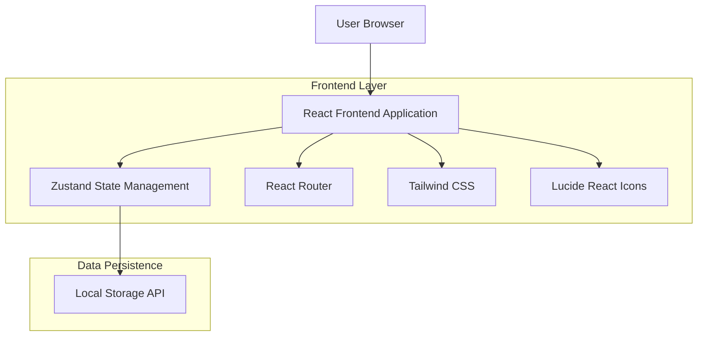
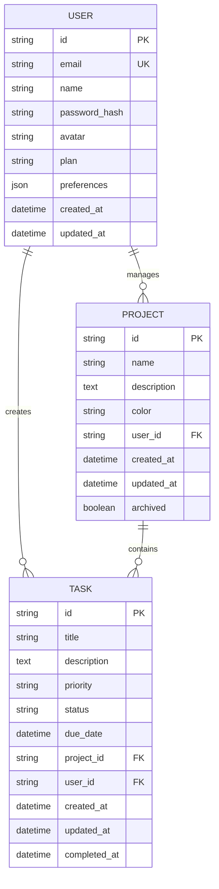

## 1. Architecture design



## 2. Technology Description

- **Frontend**: React@18 + TypeScript@5 + Vite@5 + TailwindCSS@3
- **State Management**: Zustand@4
- **Routing**: React Router@6
- **UI Components**: HeadlessUI + Radix UI
- **Icons**: Lucide React
- **Charts**: Chart.js + React Chart.js 2
- **Forms**: React Hook Form + Zod
- **Date Management**: date-fns
- **Backend**: Local Storage API (persistência client-side)

## 3. Route definitions

| Route | Purpose |
|-------|---------|
| / | Landing page, apresentação do produto e call-to-action |
| /dashboard | Dashboard principal com visão geral das tarefas e estatísticas |
| /tasks | Lista de tarefas com funcionalidades CRUD completas |
| /tasks/new | Formulário de criação de nova tarefa |
| /tasks/:id/edit | Formulário de edição de tarefa existente |
| /projects | Gerenciamento de projetos e visualização por projeto |
| /projects/new | Criação de novo projeto |
| /projects/:id | Detalhes do projeto com lista de tarefas vinculadas |
| /calendar | Visualização de calendário mensal/semanal com tarefas |
| /reports | Dashboard de relatórios e análises de produtividade |
| /settings | Configurações de perfil, preferências e assinatura |
| /login | Página de autenticação de usuários |
| /register | Página de registro de novos usuários |
| /premium | Página de upgrade para plano premium |

## 4. Component Architecture

### 4.1 Core Components Structure

```
src/
├── components/
│   ├── common/
│   │   ├── Button.tsx
│   │   ├── Input.tsx
│   │   ├── Card.tsx
│   │   ├── Modal.tsx
│   │   ├── Badge.tsx
│   │   └── LoadingSpinner.tsx
│   ├── layout/
│   │   ├── Header.tsx
│   │   ├── Sidebar.tsx
│   │   ├── Footer.tsx
│   │   └── Layout.tsx
│   ├── tasks/
│   │   ├── TaskList.tsx
│   │   ├── TaskCard.tsx
│   │   ├── TaskForm.tsx
│   │   ├── TaskFilters.tsx
│   │   └── TaskPriorityBadge.tsx
│   ├── projects/
│   │   ├── ProjectList.tsx
│   │   ├── ProjectCard.tsx
│   │   ├── ProjectForm.tsx
│   │   └── ProjectProgress.tsx
│   ├── dashboard/
│   │   ├── StatsCards.tsx
│   │   ├── ActivityChart.tsx
│   │   ├── RecentTasks.tsx
│   │   └── UpcomingTasks.tsx
│   ├── calendar/
│   │   ├── CalendarGrid.tsx
│   │   ├── CalendarCell.tsx
│   │   └── CalendarTaskModal.tsx
│   └── reports/
│       ├── ProductivityChart.tsx
│       ├── ProjectComparison.tsx
│       └── ReportFilters.tsx
```

### 4.2 State Management Architecture

```typescript
// Store Types
interface Task {
  id: string;
  title: string;
  description: string;
  priority: 'high' | 'medium' | 'low';
  status: 'pending' | 'in-progress' | 'completed';
  dueDate: Date;
  projectId: string;
  createdAt: Date;
  updatedAt: Date;
}

interface Project {
  id: string;
  name: string;
  description: string;
  color: string;
  createdAt: Date;
  updatedAt: Date;
}

interface User {
  id: string;
  email: string;
  name: string;
  avatar?: string;
  plan: 'free' | 'premium';
  preferences: UserPreferences;
}

interface UserPreferences {
  theme: 'light' | 'dark';
  dateFormat: string;
  notifications: boolean;
  language: string;
}
```

### 4.3 Store Implementation

```typescript
// Task Store
const useTaskStore = create<TaskStore>((set, get) => ({
  tasks: [],
  filters: { status: 'all', priority: 'all', projectId: 'all' },
  
  addTask: (task) => set((state) => ({ 
    tasks: [...state.tasks, task] 
  })),
  
  updateTask: (id, updates) => set((state) => ({
    tasks: state.tasks.map(task => 
      task.id === id ? { ...task, ...updates } : task
    )
  })),
  
  deleteTask: (id) => set((state) => ({
    tasks: state.tasks.filter(task => task.id !== id)
  })),
  
  setFilters: (filters) => set({ filters }),
  
  getFilteredTasks: () => {
    const { tasks, filters } = get();
    return tasks.filter(task => {
      if (filters.status !== 'all' && task.status !== filters.status) return false;
      if (filters.priority !== 'all' && task.priority !== filters.priority) return false;
      if (filters.projectId !== 'all' && task.projectId !== filters.projectId) return false;
      return true;
    });
  }
}));
```

## 5. Data Model

### 5.1 Data Model Definition



### 5.2 Local Storage Schema

```typescript
// Local Storage Keys
const STORAGE_KEYS = {
  USER: 'detailx_user',
  TASKS: 'detailx_tasks',
  PROJECTS: 'detailx_projects',
  PREFERENCES: 'detailx_preferences',
  SESSION: 'detailx_session'
} as const;

// Data Structure for Local Storage
interface LocalStorageData {
  user: User | null;
  tasks: Task[];
  projects: Project[];
  preferences: UserPreferences;
  session: {
    isAuthenticated: boolean;
    lastActivity: Date;
  };
}
```

## 6. Design System

### 6.1 Color Palette

```typescript
const colors = {
  primary: {
    50: '#eff6ff',
    100: '#dbeafe',
    500: '#3b82f6',
    600: '#2563eb',
    700: '#1d4ed8',
    900: '#1e3a8a'
  },
  success: {
    50: '#ecfdf5',
    500: '#10b981',
    600: '#059669'
  },
  warning: {
    50: '#fffbeb',
    500: '#f59e0b',
    600: '#d97706'
  },
  error: {
    50: '#fef2f2',
    500: '#ef4444',
    600: '#dc2626'
  },
  gray: {
    50: '#f9fafb',
    100: '#f3f4f6',
    500: '#6b7280',
    700: '#374151',
    900: '#111827'
  }
};
```

### 6.2 Typography

```typescript
const typography = {
  fontFamily: {
    sans: ['Inter', 'system-ui', 'sans-serif'],
    mono: ['Fira Code', 'monospace']
  },
  fontSize: {
    xs: '0.75rem',
    sm: '0.875rem',
    base: '1rem',
    lg: '1.125rem',
    xl: '1.25rem',
    '2xl': '1.5rem',
    '3xl': '1.875rem',
    '4xl': '2.25rem'
  },
  fontWeight: {
    normal: '400',
    medium: '500',
    semibold: '600',
    bold: '700'
  }
};
```

### 6.3 Component Variants

```typescript
// Button Variants
const buttonVariants = {
  primary: 'bg-blue-600 text-white hover:bg-blue-700',
  secondary: 'bg-gray-200 text-gray-900 hover:bg-gray-300',
  outline: 'border border-gray-300 text-gray-700 hover:bg-gray-50',
  ghost: 'text-gray-700 hover:bg-gray-100',
  danger: 'bg-red-600 text-white hover:bg-red-700'
};

// Input Variants
const inputVariants = {
  default: 'border-gray-300 focus:border-blue-500 focus:ring-blue-500',
  error: 'border-red-300 focus:border-red-500 focus:ring-red-500',
  success: 'border-green-300 focus:border-green-500 focus:ring-green-500'
};
```

## 7. Performance Optimization

### 7.1 Code Splitting

```typescript
// Lazy loading for route components
const Dashboard = lazy(() => import('./pages/Dashboard'));
const Tasks = lazy(() => import('./pages/Tasks'));
const Projects = lazy(() => import('./pages/Projects'));
const Calendar = lazy(() => import('./pages/Calendar'));
const Reports = lazy(() => import('./pages/Reports'));
```

### 7.2 Memoization Strategy

```typescript
// Component memoization
const TaskCard = memo(({ task, onUpdate, onDelete }: TaskCardProps) => {
  // Component implementation
}, (prevProps, nextProps) => {
  return prevProps.task.id === nextProps.task.id &&
         prevProps.task.updatedAt === nextProps.task.updatedAt;
});

// Computed values memoization
const useMemoizedTasks = () => {
  const tasks = useTaskStore(state => state.tasks);
  const filters = useTaskStore(state => state.filters);
  
  return useMemo(() => {
    return tasks.filter(task => {
      // Filter logic
      return applyFilters(task, filters);
    });
  }, [tasks, filters]);
};
```

## 8. Testing Strategy

### 8.1 Unit Testing

```typescript
// Component testing with React Testing Library
import { render, screen, fireEvent } from '@testing-library/react';
import TaskCard from '../components/tasks/TaskCard';

describe('TaskCard', () => {
  it('should render task information correctly', () => {
    const task = {
      id: '1',
      title: 'Test Task',
      priority: 'high',
      status: 'pending'
    };
    
    render(<TaskCard task={task} />);
    
    expect(screen.getByText('Test Task')).toBeInTheDocument();
    expect(screen.getByText('High Priority')).toBeInTheDocument();
  });
});
```

### 8.2 Integration Testing

```typescript
// Store testing
import { renderHook, act } from '@testing-library/react-hooks';
import useTaskStore from '../stores/taskStore';

describe('TaskStore', () => {
  it('should add task correctly', () => {
    const { result } = renderHook(() => useTaskStore());
    
    act(() => {
      result.current.addTask({
        id: '1',
        title: 'New Task',
        priority: 'medium'
      });
    });
    
    expect(result.current.tasks).toHaveLength(1);
    expect(result.current.tasks[0].title).toBe('New Task');
  });
});
```

## 9. Build and Deployment

### 9.1 Build Configuration

```typescript
// vite.config.ts
import { defineConfig } from 'vite';
import react from '@vitejs/plugin-react';
import path from 'path';

export default defineConfig({
  plugins: [react()],
  resolve: {
    alias: {
      '@': path.resolve(__dirname, './src'),
      '@components': path.resolve(__dirname, './src/components'),
      '@stores': path.resolve(__dirname, './src/stores'),
      '@utils': path.resolve(__dirname, './src/utils'),
      '@types': path.resolve(__dirname, './src/types')
    }
  },
  build: {
    rollupOptions: {
      output: {
        manualChunks: {
          'react-vendor': ['react', 'react-dom'],
          'ui-vendor': ['@headlessui/react', '@radix-ui/react-dialog'],
          'chart-vendor': ['chart.js', 'react-chartjs-2']
        }
      }
    }
  }
});
```

### 9.2 Environment Variables

```typescript
// .env
VITE_APP_NAME=DetailX
VITE_APP_VERSION=1.0.0
VITE_API_URL=http://localhost:3000
VITE_STRIPE_PUBLIC_KEY=pk_test_...
VITE_ENABLE_ANALYTICS=true
```